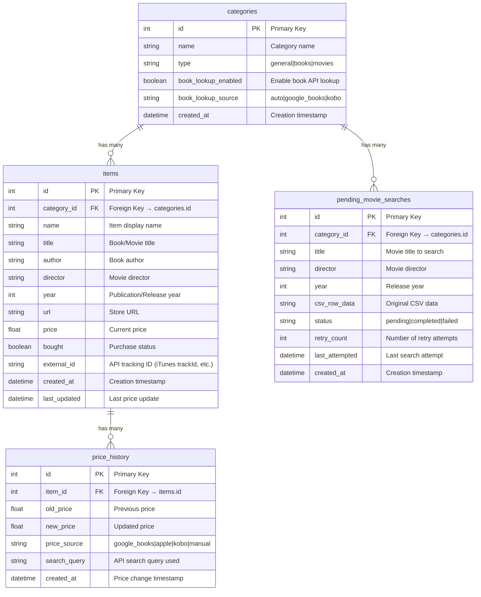

# Database Schema - Price Tracker

## Entity Relationship Diagram



## Table Relationships

### 1. **categories → items** (One-to-Many)
- Each category can contain multiple items
- Items belong to exactly one category
- **Cascade**: Deleting a category deletes all its items

### 2. **items → price_history** (One-to-Many)
- Each item can have multiple price history entries
- Each price history entry belongs to one item
- **Cascade**: Deleting an item deletes all its price history

### 3. **categories → pending_movie_searches** (One-to-Many)
- Each category can have pending movie searches
- Used for batch CSV imports
- **Cascade**: Deleting a category deletes pending searches

## Key Design Decisions

### **External ID Tracking**
- `items.external_id` stores API-specific identifiers (iTunes trackId, Google Books ID)
- Enables accurate price refresh by exact lookup instead of search
- Prevents price drift from similar items

### **Price History Tracking**
- Every price change is recorded in `price_history`
- Tracks both old and new prices for complete audit trail
- Includes source (API) and search query for debugging

### **Category Types**
- `general`: Basic items with manual price tracking
- `books`: Auto-parsing of "Title by Author" format
- `movies`: iTunes API integration with trackId storage

### **Flexible Item Structure**
- Optional fields (`title`, `author`, `director`, `year`) support different item types
- `name` is always required as display name
- Type-specific fields are used based on category type

## SQLAlchemy Relationships

```python
# Category Model
class Category(db.Model):
    items = relationship('Item', back_populates='category', cascade='all, delete-orphan')

# Item Model  
class Item(db.Model):
    category = relationship('Category', back_populates='items')
    price_history = relationship('PriceHistory', back_populates='item', cascade='all, delete-orphan')

# PriceHistory Model
class PriceHistory(db.Model):
    item = relationship('Item', back_populates='price_history')
```

## Indexes (Recommended)

```sql
-- Performance indexes for common queries
CREATE INDEX idx_items_category_created ON items(category_id, created_at DESC);
CREATE INDEX idx_price_history_item_created ON price_history(item_id, created_at ASC);
CREATE INDEX idx_items_external_id ON items(external_id);
CREATE INDEX idx_categories_type ON categories(type);
```

## Migration Notes

- **Backwards Compatible**: New SQLAlchemy schema preserves all existing data
- **Automatic Migration**: `migrate_existing_data()` handles conversion from raw SQLite
- **Data Integrity**: Foreign key constraints ensure referential integrity
- **Timestamps**: All models include creation and update timestamps